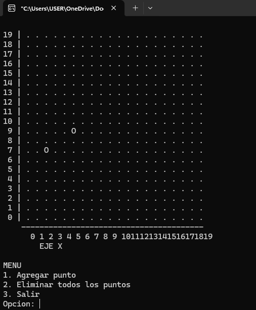

# Plano Cartesiano

Ejercicio practico de la materia de **Estructuras de Datos Avanzado**, enfocado en el uso de clases, objetos y vectores en C++. El programa implementa un plano cartesiano simple en consola donde el usuario puede agregar y eliminar puntos de forma interactiva, usando dos clases bien definidas: `PlanoCartesiano` y `Punto2D`.

---

## Descripcion

Este ejercicio fue una introduccion al manejo de clases en C++ aplicado a un caso concreto: representar puntos en un plano cartesiano. La logica del plano esta encapsulada dentro de la clase `PlanoCartesiano`, que maneja internamente una matriz de caracteres para representar la cuadricula. Los puntos se modelan con la clase `Punto2D` y se almacenan en un `vector` dinamico que crece conforme el usuario los va agregando.

Cada vez que se ejecuta una accion del menu, el plano se redibuja desde cero para reflejar el estado actual de los puntos.

---

## Captura de pantalla

La siguiente imagen muestra el programa en funcionamiento con varios puntos agregados al plano. Se puede ver la cuadricula con el eje Y a la izquierda y el eje X abajo, y los puntos marcados con el simbolo `O` en sus coordenadas correspondientes.



---

## Caracteristicas

- Plano cartesiano de 20x20 representado con una matriz de caracteres
- Clase `PlanoCartesiano` que encapsula toda la logica de la cuadricula
- Clase `Punto2D` que representa cada punto con sus coordenadas X e Y
- Almacenamiento dinamico de puntos usando `std::vector`
- El plano se redibuja automaticamente despues de cada accion
- Menu interactivo con opciones para agregar y eliminar puntos
- Validacion de coordenadas fuera del rango del plano

---

## Estructura del codigo

```
plano_oop.cpp
|
|-- Constantes: MAX_X, MAX_Y (dimensiones del plano: 20x20)
|
|-- Clase PlanoCartesiano
|     |-- plano[MAX_Y][MAX_X]  (matriz interna de caracteres)
|     |-- reiniciarPlano()     (llena la matriz con '.')
|     |-- colocarPunto()       (escribe un simbolo en la posicion correcta)
|     |-- imprimirPlano()      (dibuja la cuadricula en consola con ejes)
|
|-- Clase Punto2D
|     |-- x, y                 (coordenadas del punto)
|     |-- dibujar()            (llama a colocarPunto con el simbolo 'O')
|
|-- main()
      |-- vector<Punto2D> puntos
      |-- Bucle do-while con menu de opciones
```

---

## Como compilar y ejecutar

```bash
g++ -std=c++17 -o plano plano_oop.cpp
./plano
```

En CodeBlocks o Visual Studio simplemente abre el archivo y compila normalmente.

---

## Como usar

Al ejecutar el programa se dibuja el plano vacio y aparece el menu:

```
MENU
1. Agregar punto
2. Eliminar todos los puntos
3. Salir
Opcion:
```

Escribe `1` para agregar un punto, luego ingresa la coordenada X y la coordenada Y dentro del rango `0-19`. El punto aparecera marcado con `O` en el plano. Con la opcion `2` se borran todos los puntos a la vez. El plano se actualiza automaticamente despues de cada accion.

---

## Conceptos aplicados

- **Clases y objetos**: separacion de responsabilidades entre `PlanoCartesiano` y `Punto2D`
- **Encapsulamiento**: la matriz interna del plano es privada y solo se modifica a traves de los metodos de la clase
- **Vectores dinamicos**: uso de `std::vector<Punto2D>` para manejar una cantidad variable de puntos
- **Matrices 2D**: representacion del plano como arreglo bidimensional de caracteres
- **Inversion del eje Y**: la coordenada Y se invierte al mapear al arreglo porque en consola las filas crecen hacia abajo (`fila = (MAX_Y - 1) - y`)

---

## Tecnologias

- **Lenguaje**: C++
- **Librerias**: `iostream`, `vector`
- **Compatibilidad**: Windows, Linux, macOS

---

*Ejercicio desarrollado como parte del curso de Estructuras de Datos Avanzado.*
