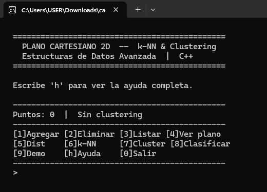
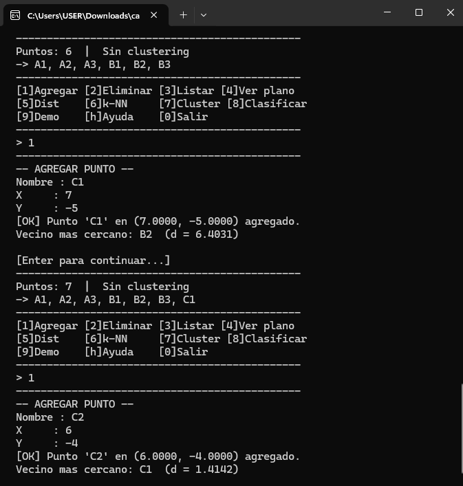
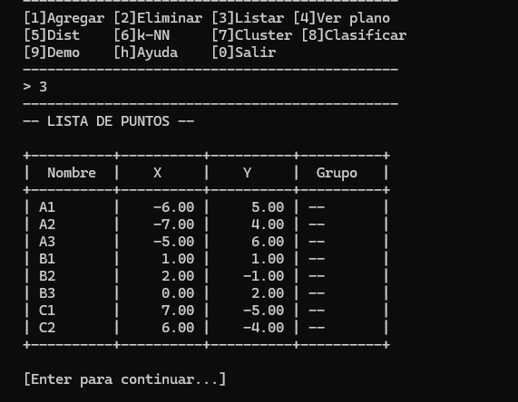
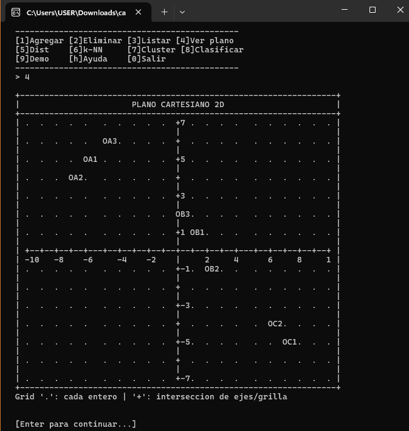
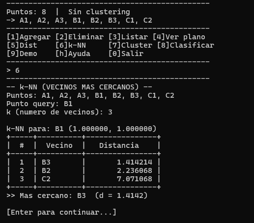
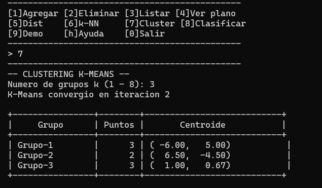
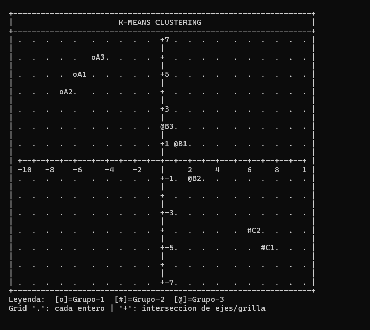
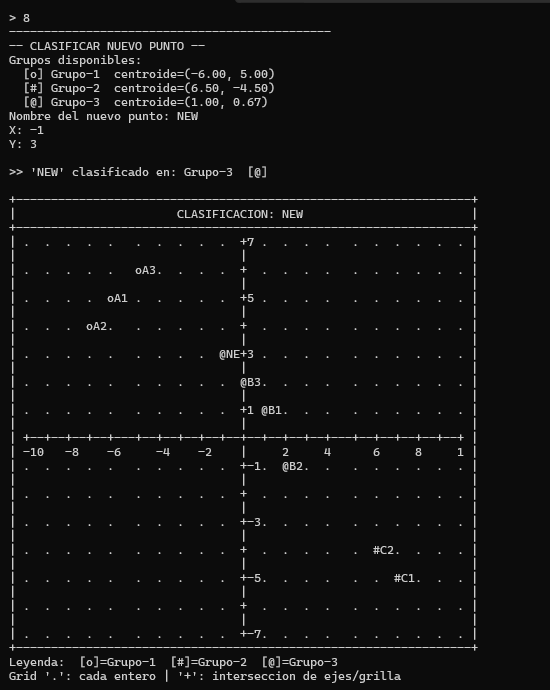

# Plano Cartesiano 2D — k-NN & Clustering en C++

Proyecto desarrollado para la materia de **Estructuras de Datos y Algoritmos**, implementado completamente en C++17 usando solo la librería estándar. El programa simula un plano cartesiano bidimensional en consola, permite gestionar puntos, calcular distancias euclidianas, encontrar vecinos cercanos con k-NN y agrupar puntos usando K-Means clustering, todo visualizado con ASCII art directamente en la terminal.

---

## Tabla de contenidos

- [Descripcion general](#descripcion-general)
- [Caracteristicas](#caracteristicas)
- [Requisitos](#requisitos)
- [Como compilar](#como-compilar)
- [Como usar el programa](#como-usar-el-programa)
- [Capturas de pantalla](#capturas-de-pantalla)
- [Algoritmos implementados](#algoritmos-implementados)
- [Estructura del codigo](#estructura-del-codigo)
- [Analisis de complejidad](#analisis-de-complejidad)

---

## Descripcion general

La idea del proyecto fue construir desde cero un sistema que permita trabajar con puntos en un plano cartesiano, aplicar algoritmos clasicos de aprendizaje automatico supervisado y no supervisado, y ver los resultados de forma grafica en la consola sin usar ninguna libreria externa ni framework. Todo el codigo esta en un solo archivo `.cpp` y corre en Windows, Linux y macOS.

---

## Caracteristicas

- Visualizacion del plano cartesiano con grid de puntos en cada interseccion entera
- Ejes X e Y con etiquetas numericas
- Agregar, eliminar y listar puntos con nombre y coordenadas
- Calculo de distancia euclidiana entre cualquier par de puntos
- **k-NN automatico**: al agregar un punto se calcula su vecino mas cercano en tiempo real
- **K-Means Clustering** con inicializacion K-Means++ para mejor convergencia
- Clasificacion de nuevos puntos al grupo mas cercano segun centroides
- Menu compacto tipo barra de estado que no satura la pantalla
- Demo automatico con 15 puntos y 3 clusters naturales
- 100% compatible con Windows (CodeBlocks, Visual Studio, MinGW) — ASCII puro, sin Unicode ni codigos ANSI

---

## Requisitos

- Compilador C++17 o superior
- Windows, Linux o macOS
- No requiere librerias externas

---

## Como compilar

```bash
g++ -std=c++17 -O2 -o plano cartesian_plane_v3.cpp
```

En CodeBlocks o Visual Studio simplemente abre el archivo y compila con C++17 habilitado.

---

## Como usar el programa

Al ejecutar el programa aparece una **barra de estado compacta** que muestra cuantos puntos hay cargados, sus nombres, y las opciones disponibles en dos lineas. No se repite un menu largo despues de cada accion, solo la barra de estado actualizada.

```
  ----------------------------------------------
  Puntos: 3  |  Sin clustering
  -> A1, B1, C1
  ----------------------------------------------
  [1]Agregar [2]Eliminar [3]Listar [4]Ver plano
  [5]Dist    [6]k-NN     [7]Cluster [8]Clasificar
  [9]Demo    [h]Ayuda    [0]Salir
  ----------------------------------------------
  >
```

Escribe el numero de la opcion y presiona Enter. Para ver la descripcion completa de cada opcion escribe `h`.

---

## Capturas de pantalla

### Pantalla de inicio

Al ejecutar el programa se muestra el encabezado del proyecto y la barra de estado inicial con cero puntos cargados. Desde aqui ya se puede empezar a agregar puntos o correr el demo.



---

### Agregar puntos y k-NN automatico

Cada vez que se agrega un punto nuevo (opcion `1`), el programa calcula automaticamente cual es su vecino mas cercano entre los puntos ya existentes y muestra la distancia. En esta captura se puede ver el mensaje despues de agregar el punto `B1`: el sistema identifico que su vecino mas cercano era `A2` con una distancia de aproximadamente 9.43 unidades.



---

### Lista de puntos

La opcion `3` muestra todos los puntos en una tabla ordenada con nombre, coordenada X, coordenada Y y el grupo al que pertenecen (si ya se ejecuto el clustering). Antes del clustering el grupo aparece como `--`.



---

### Visualizacion del plano cartesiano

Esta es la visualizacion principal del programa. Cada `.` representa una interseccion entera del plano (es decir, un punto donde las coordenadas X e Y son numeros enteros). Los `+` marcan donde la grilla cruza los ejes. Los ejes tienen etiquetas numericas para poder ubicar visualmente cada punto con facilidad. Los puntos del dataset aparecen con su simbolo y su nombre a la derecha.



---

### Distancia euclidiana

La opcion `5` calcula la distancia euclidiana entre dos puntos cualesquiera usando la formula clasica. En este ejemplo se calcula la distancia entre `A1` y `C1`, que estan en extremos opuestos del plano.


---

### k-NN: vecinos mas cercanos

La opcion `6` permite buscar los k vecinos mas cercanos a cualquier punto del dataset. Se especifica el punto de consulta y el numero de vecinos deseados. El resultado es una tabla ordenada por distancia de menor a mayor, resaltando siempre el vecino mas proximo.



---

### K-Means Clustering — tabla de grupos

Al ejecutar el clustering con la opcion `7` y especificar el numero de grupos `k`, el algoritmo corre K-Means con inicializacion K-Means++ y muestra primero la tabla de estadisticas: cuantos puntos quedaron en cada grupo y donde quedo el centroide final de cada uno.



---

### K-Means Clustering — plano con grupos diferenciados

Inmediatamente despues de la tabla, el programa dibuja el plano con cada grupo representado por un simbolo distinto (`o`, `#`, `@`, etc.) y muestra la leyenda abajo. Se puede ver claramente como el algoritmo separo los puntos en regiones. Esta es la visualizacion mas completa del proyecto.



---

### Clasificacion de nuevo punto

Una vez que se tiene el clustering, la opcion `8` permite ingresar un nuevo punto y el sistema lo asigna automaticamente al grupo cuyo centroide esta mas cerca. En esta captura se clasifico el punto `NEW` y se muestra el plano actualizado con el nuevo punto ya integrado a su grupo.



---

## Algoritmos implementados

### Distancia Euclidiana

Calcula la distancia geometrica entre dos puntos en el plano 2D.

```
d(A, B) = sqrt((Bx - Ax)^2 + (By - Ay)^2)
```

### k-Nearest Neighbor (k-NN)

Dado un punto de consulta, encuentra los `k` puntos mas cercanos del dataset. El enfoque usado es fuerza bruta con ordenamiento:

1. Calcular la distancia del punto query a todos los demas puntos del dataset.
2. Ordenar las distancias de menor a mayor con `std::sort`.
3. Retornar los primeros `k` resultados.

Este metodo es simple, correcto y suficientemente rapido para datasets de tamano educativo. Para datasets grandes se podria optimizar con una estructura k-d tree que reduce las consultas a O(log n).

### K-Means Clustering (Algoritmo de Lloyd + K-Means++)

El clustering agrupa los puntos en `k` grupos intentando minimizar la varianza interna de cada grupo. El proceso es:

**Inicializacion K-Means++** (mejora sobre la inicializacion aleatoria):
- El primer centroide se elige aleatoriamente.
- Cada centroide siguiente se elige con probabilidad proporcional a la distancia al cuadrado al centroide mas cercano ya elegido. Esto garantiza que los centroides iniciales queden bien separados y reduce la probabilidad de converger a un minimo local malo.

**Iteracion de Lloyd** (hasta convergencia o maximo 300 iteraciones):
- **Paso E**: Asignar cada punto al centroide mas cercano.
- **Paso M**: Recalcular cada centroide como la media aritmetica de todos los puntos asignados a ese grupo.
- Si ningun punto cambio de grupo, el algoritmo convergio y se detiene.

### Clasificacion por centroide

Para clasificar un punto nuevo se calcula su distancia a cada centroide del clustering previo y se le asigna el grupo del centroide mas cercano. Es equivalente a un 1-NN sobre el conjunto de centroides.

---

## Estructura del codigo

El archivo esta dividido en modulos bien delimitados con comentarios:

```
cartesian_plane_v3.cpp
|
|-- Constantes y configuracion del canvas
|-- Estructuras de datos (Point, Group, DistancePair)
|-- Modulo 1: euclideanDistance()
|-- Modulo 2: mapX(), mapY(), drawPlane()
|-- Modulo 3: listPoints()
|-- Modulo 4: kNN(), printKNN()
|-- Modulo 5: kMeans(), printClusterStats()
|-- Modulo 6: classifyPoint()
|-- Utilidades: findPoint(), pointNamesList(), sep(), pausar()
|-- UI: printHeader(), printStatus(), printHelp()
|-- Demo: runDemo()
|-- main()
```

---

## Analisis de complejidad

| Operacion | Complejidad temporal | Complejidad espacial |
|---|---|---|
| Distancia euclidiana | O(1) | O(1) |
| k-NN (fuerza bruta) | O(n log n) | O(n) |
| K-Means++ inicializacion | O(k * n) | O(n) |
| K-Means iteracion completa | O(I * k * n) | O(n + k) |
| Clasificacion por centroide | O(k) | O(1) |
| Visualizacion del plano | O(W * H) | O(W * H) |

Donde `n` = cantidad de puntos, `k` = numero de grupos, `I` = iteraciones hasta convergencia (maximo 300), `W` y `H` = dimensiones del canvas ASCII (63 x 29).

---

## Tecnologias

- **Lenguaje**: C++17
- **Librerias**: Solo STL (`iostream`, `vector`, `cmath`, `algorithm`, `random`, `string`, `iomanip`)
- **Compatibilidad**: Windows, Linux, macOS
- **IDE probado**: CodeBlocks, Visual Studio

---

*Proyecto desarrollado como parte del curso de Estructuras de Datos y Algoritmos.*
